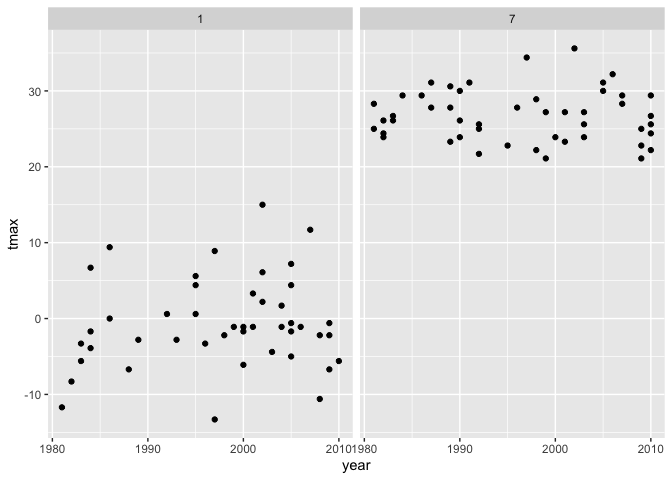
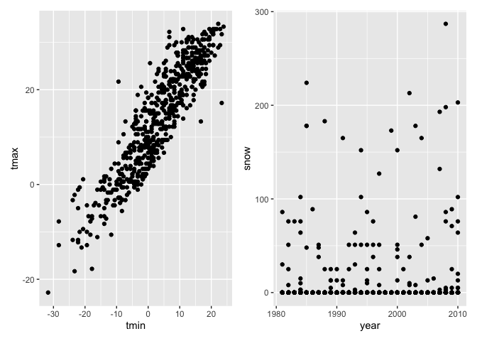

Homework 3
================
Sanjana Batabyal

This is my solution to Homework 3.

``` r
library(tidyverse)
```

    ## ── Attaching packages ───────────────────────────────────────── tidyverse 1.3.0 ──

    ## ✓ ggplot2 3.3.2     ✓ purrr   0.3.4
    ## ✓ tibble  3.0.3     ✓ dplyr   1.0.2
    ## ✓ tidyr   1.1.2     ✓ stringr 1.4.0
    ## ✓ readr   1.3.1     ✓ forcats 0.5.0

    ## ── Conflicts ──────────────────────────────────────────── tidyverse_conflicts() ──
    ## x dplyr::filter() masks stats::filter()
    ## x dplyr::lag()    masks stats::lag()

``` r
library(magrittr)
```

    ## 
    ## Attaching package: 'magrittr'

    ## The following object is masked from 'package:purrr':
    ## 
    ##     set_names

    ## The following object is masked from 'package:tidyr':
    ## 
    ##     extract

``` r
library(p8105.datasets)
library(dplyr)
library(rnoaa)
```

    ## Registered S3 method overwritten by 'hoardr':
    ##   method           from
    ##   print.cache_info httr

``` r
library(patchwork)
```

## Problem 1

Loading the data.

``` r
data("instacart")
```

``` r
instacart %>%
  count(aisle) %>%
  arrange(desc(n))
```

    ## # A tibble: 134 x 2
    ##    aisle                              n
    ##    <chr>                          <int>
    ##  1 fresh vegetables              150609
    ##  2 fresh fruits                  150473
    ##  3 packaged vegetables fruits     78493
    ##  4 yogurt                         55240
    ##  5 packaged cheese                41699
    ##  6 water seltzer sparkling water  36617
    ##  7 milk                           32644
    ##  8 chips pretzels                 31269
    ##  9 soy lactosefree                26240
    ## 10 bread                          23635
    ## # … with 124 more rows

There are 134 aisles and the aisles that are most ordered from are fresh
vegetables (with 150,609 items) and fresh fruits (with 150,473 items).

Making a plot that shows the number of items ordered in each aisle.

``` r
instacart %>%
  count(aisle) %>%
  filter(n > 10000) %>%
  mutate(
    aisle = factor(aisle),
    aisle = fct_reorder(aisle, n)
  ) %>%
  ggplot(aes(x=aisle, y=n)) +
  geom_point()
```

<!-- -->
Making a table showing the three most popular items in each of the
aisles “baking ingredients”, “dog food care”, and “packaged vegetables
fruits”.

``` r
instacart %>%
  filter(aisle %in% c("baking ingredients", "dog food care", "packaged vegetable fruits")) %>%
  group_by(aisle) %>%
  count(product_name) %>%
  mutate(rank = min_rank(desc(n)))%>%
  filter(rank<4) %>%
  arrange(aisle, rank) %>%
  knitr::kable()
```

| aisle              | product\_name                                 |   n | rank |
| :----------------- | :-------------------------------------------- | --: | ---: |
| baking ingredients | Light Brown Sugar                             | 499 |    1 |
| baking ingredients | Pure Baking Soda                              | 387 |    2 |
| baking ingredients | Cane Sugar                                    | 336 |    3 |
| dog food care      | Snack Sticks Chicken & Rice Recipe Dog Treats |  30 |    1 |
| dog food care      | Organix Chicken & Brown Rice Recipe           |  28 |    2 |
| dog food care      | Small Dog Biscuits                            |  26 |    3 |

Making a table showing the mean hour of the day at which Pink Lady
Apples and Coffee Ice Cream are ordered on each day of the week.

``` r
instacart %>%
  filter(product_name %in% c("Pink Lady Apples", "Coffee Ice Cream")) %>%
  group_by(product_name, order_dow) %>%
  summarize(mean_hour=mean(order_hour_of_day)) %>%
  pivot_wider(
    names_from = order_dow,
    values_from = mean_hour
  )
```

    ## `summarise()` regrouping output by 'product_name' (override with `.groups` argument)

    ## # A tibble: 2 x 8
    ## # Groups:   product_name [2]
    ##   product_name       `0`   `1`   `2`   `3`   `4`   `5`   `6`
    ##   <chr>            <dbl> <dbl> <dbl> <dbl> <dbl> <dbl> <dbl>
    ## 1 Coffee Ice Cream  13.8  14.3  15.4  15.3  15.2  12.3  13.8
    ## 2 Pink Lady Apples  13.4  11.4  11.7  14.2  11.6  12.8  11.9

\#\#Problem 3 Data importation and cleaning/wrangling.

``` r
data("ny_noaa")
```

``` r
ny_noaa %>% 
  slice_sample(n=1000) %>%
  separate(date, into = c("year", "month", "day"), convert = TRUE) %>%
  mutate(tmax = as.numeric(tmax)/10,tmin = as.numeric(tmin)/10)
```

    ## # A tibble: 1,000 x 9
    ##    id           year month   day  prcp  snow  snwd  tmax  tmin
    ##    <chr>       <int> <int> <int> <int> <int> <int> <dbl> <dbl>
    ##  1 USC00308910  2007     2    16     5     5   533 -11.1 -21.7
    ##  2 USC00300379  2006    10    30     0    NA    NA  NA    NA  
    ##  3 USC00308578  1993     1    25   145    51    NA  NA    NA  
    ##  4 USC00303346  1994     6     1    13     0     0  27.8  10.6
    ##  5 USC00302582  2009    10    26     0     0     0  NA    NA  
    ##  6 USW00094740  2003     4     6     0    NA    NA  -2.8 -16.7
    ##  7 USC00308586  2005     2     4     0     0    NA  NA    NA  
    ##  8 USC00304207  1985     4    26     0     0     0  17.2   0.6
    ##  9 USC00305426  1988     7    13     0     0     0  30    17.8
    ## 10 USC00303346  1992     7     8    25     0     0  24.4  10  
    ## # … with 990 more rows

The most commonly recorded value for snowfall is 0 mm because this data
set records information from throughout the year – and since it only
snows during the late-fall and winter, for a majority of the year, there
will be no snowfall.

Making a two-panel plot showing the average max temperature in January
and in July in each station across years.

``` r
ny_noaa %>%
  slice_sample(n=1000) %>%
  mutate(tmax = as.numeric(tmax)/10,tmin = as.numeric(tmin)/10) %>%
  separate(date, into = c("year", "month", "day"), convert = TRUE) %>%
  filter(month==1|month==7) %>%
  ggplot(aes(x=year, y=tmax), color=year) +
  geom_point() +
  facet_grid(. ~month)
```

    ## Warning: Removed 58 rows containing missing values (geom_point).

<!-- -->
Making a two-panel plot showing tmax vs tmin for the full dataset and a
plot showing the distribution of snowfall values greater than 0 and less
than 100 separately by year.

``` r
temp=
ny_noaa %>%
  slice_sample(n=1000) %>%
  mutate(tmax = as.numeric(tmax)/10,tmin = as.numeric(tmin)/10) %>%
  separate(date, into = c("year", "month", "day"), convert = TRUE) %>%
  ggplot(aes(x=tmin, y=tmax), color=years) +
  geom_point()

snowfall=
ny_noaa %>%
  slice_sample(n=1000) %>%
  separate(date, into = c("year", "month", "day"), convert = TRUE) %>%
  filter(snow>0|snow<100) %>%
  ggplot(aes(x=year, y=snow), color=snow) +
  geom_point()

temp+snowfall
```

    ## Warning: Removed 420 rows containing missing values (geom_point).

<!-- -->
